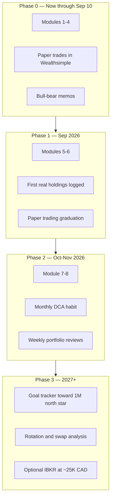

# Trading Learning Roadmap — 1MillionPortfolio

Your personalized curriculum from zero → confident GARP investor on Wealthsimple.

**Profile:** Beginner | TFSA | $8K CAD | Manual execution | GARP style | Paper trading until ~2026-09-10

---

## Where we have already learned

### A. System setup (Aug 2026)

| Topic | What you did | Where it lives |
|-------|--------------|----------------|
| Investment agent | Built GARP portfolio manager with rules, skills, hooks | `AGENTS.md`, `.cursor/rules/` |
| MCP data stack | Connected Equibles, FinanceKit (+ Rebalance-MCP when fixed) | `config/MCP_SETUP.md` |
| Manual mode | Skipped wsli (no official WS API) — you trade in app | `portfolio/profile.yaml` |
| Paper trading | 4-week practice period before treating trades as "graduated" | `portfolio/paper-trading.yaml` |

### B. Concepts from our sessions

| Concept | What you learned |
|---------|------------------|
| **GARP** | Growth At Reasonable Price — grow earnings without overpaying (P/E, PEG) |
| **Cold-start basket** | MSFT, NVDA, GOOGL, AMZN — ~$2K CAD each from $8K |
| **Why red days happen** | Index down (NASDAQ -0.3%), single names down (AVGO -5.7%), not always "bad news" |
| **Buy the dip** | GOOGL/AMZN down slightly = better entry if thesis intact |
| **Overbought** | MSFT RSI ~72, PLTR extended — caution adding large size |
| **Momentum vs GARP** | PLTR/SMCI = short-term heat; higher risk than GARP core |
| **TFSA** | Tax-free growth; 15% US dividend withholding still applies |
| **Position limits** | Max 20% one stock, 15% drawdown pause on new buys |
| **Priority table** | Buy price + today's bias + why — from live FinanceKit data |

### C. Reports generated

| Report | Path |
|--------|------|
| Onboarding | `research/reports/2026-08-13-onboarding.md` |
| Cold-start tickets | `research/reports/2026-08-13-cold-start-trades.md` |

### D. Paper trading progress

| Criterion | Status |
|-----------|--------|
| Dry-run tickets | 1 / 3 |
| Bull/bear memos | 0 / 5 |
| Daily GARP scans | 0 / 20 |
| Weeks | 1 / 4 |

---

## Roadmap ahead

---

## Module 1 — Markets & accounts ✅ partial

**Goal:** Understand where your money lives and how markets work.

- [x] TFSA vs RRSP vs taxable (intro)
- [ ] How US stocks work on Wealthsimple (CAD → USD, FX spread)
- [ ] Market hours (NYSE/NASDAQ 9:30–16:00 ET)
- [ ] What moves prices (earnings, rates, sentiment)

**Practice:** Explain why your TFSA shows USD positions in CAD total value.

---

## Module 2 — Orders & execution

**Goal:** Place trades confidently in Wealthsimple.

- [ ] Market vs limit orders
- [ ] Buy in dollars (fractional) vs whole shares
- [ ] Bid/ask spread
- [ ] When NOT to market-buy (earnings day, huge gap)

**Practice:** Place a limit buy on GOOGL $2 below current price (paper or real).

---

## Module 3 — Reading a stock quote

**Goal:** Read what you see on Wealthsimple + FinanceKit.

- [ ] Price, change %, day high/low
- [ ] Volume, market cap
- [ ] 52-week range
- [ ] P/E, beta, dividend yield

**Practice:** Agent pulls `multi_quote` for your holdings; you explain each column.

---

## Module 4 — GARP & valuation

**Goal:** Know *why* we pick MSFT/GOOGL/NVDA/AMZN.

- [x] GARP definition
- [ ] P/E vs sector and vs own history
- [ ] PEG ratio
- [ ] Revenue growth + margins (Equibles)
- [ ] Bull vs bear before every new buy

**Practice:** Complete 1 bull-bear memo (`bull-bear-debate` skill) → counts toward graduation.

---

## Module 5 — Risk & position sizing

**Goal:** Never blow up an $8K account.

- [ ] Why max 20% per stock
- [ ] 15% portfolio drawdown rule
- [ ] Stop-loss vs hold (mental stops for beginners)
- [ ] Correlation — why 4 tech names still move together

**Practice:** Calculate max loss if one position drops 25%.

---

## Module 6 — Technical analysis basics

**Goal:** Use charts for *timing*, not prediction.

- [ ] RSI, MACD (plain English)
- [ ] Support / resistance
- [ ] "Overbought" ≠ sell, "oversold" ≠ buy
- [ ] When agent says "flat to slightly up today"

**Practice:** Agent runs `technical_analysis` on one holding; you state bull or bear bias.

---

## Module 7 — This project's rules

**Goal:** Operate the 1MillionPortfolio agent correctly.

- [ ] Read `portfolio/profile.yaml` constraints
- [ ] Update `holdings.yaml` after every trade
- [ ] Use trade ticket format (Action | Ticker | Amount | GARP | Why)
- [ ] Paper trading graduation checklist

**Practice:** After first buy, update holdings with agent help.

---

## Module 8 — Short-term vs long-term

**Goal:** Avoid mixing strategies.

| | GARP (your plan) | Short-term momentum |
|---|------------------|---------------------|
| Hold | Months to years | Days to weeks |
| Names | MSFT, GOOGL, AMZN, NVDA | PLTR, SMCI |
| Risk | Moderate-aggressive | High |
| Fit | $1M north star | Optional ≤25% slice |

**Practice:** Write one sentence — why GARP fits your Dec 2027 milestone better than day-trading.

---

## Weekly habits (after Module 2)

| Day | Action | Agent prompt |
|-----|--------|--------------|
| Mon | Portfolio review | "Review my portfolio" |
| Wed | Learn one module | "Teach me module X" |
| Fri | GARP scan | "Daily GARP scan on watchlist" |
| Monthly | DCA plan | "I have $750 to invest this month" |

---

## Graduation → what unlocks

When `portfolio/paper-trading.yaml` criteria pass and you set `paper_trading_complete: true`:

1. Treat proposals as live intent (still manual in Wealthsimple)
2. Start monthly DCA rhythm
3. Begin quarterly goal-tracker (`goal-tracker` skill)
4. Consider fixing Rebalance-MCP for official GARP scores

---

## Milestones to $1M (honest)

| Milestone | Target | Timeframe |
|-----------|--------|-----------|
| First fully invested | $8K deployed | Aug–Sep 2026 |
| Realistic checkpoint | ~$30K CAD | Dec 2027 |
| North star | $1M CAD | Long-term (15–25+ years with DCA) |

---

## How to start the next lesson

In chat, say:

- **"Teach me module 2 — orders"**
- **"Quiz me on P/E and GARP"**
- **"Explain today's market like module 6"**

Progress is logged in `research/reports/learning-log.md`.
